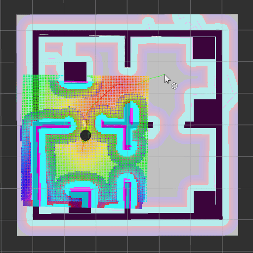
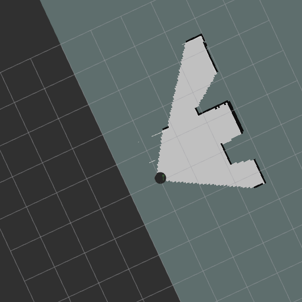
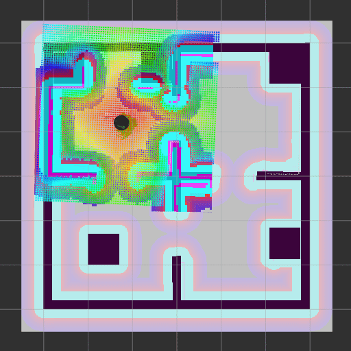

# Udacity Robotics Engineering - Home Service Robot

## Test navigation

Following a robot navigation test.

Run the following command to start Gazebo, the AMCL localization node and RVIZ.

``src/scripts/test_navigation.sh``

When you select a goal on RVIZ (i.e. a target position) the robot will move to that position.

## Test SLAM

Following a SLAM test.

Run the following command to start Gazebo, the AMCL localization node, RVIZ and a TeleOp console to control the robot.

``src/scripts/test_slam.sh``

When the robot is moved around, it builds a map of the environment.

## Home Service Robot

Following a robot loading an item from a pick up zone and unloading it to a designated drop off zone.

Run the following command to start Gazebo, the AMCL localization node, RVIZ, the node used to send goals to the robot base and the node to display the markers on RVIZ.

``src/scripts/home_service.sh``

The "pick_objects_node" receives custom messages of type "NavigationCommand" from the topic "/navigation_command". The message contains a string (either "pick-up" or "drop-off") and an (x,y) location where the robot is instructed to move.

Examples of such messages sent using rostopic command:

``rostopic pub -1 /navigation_command pick_objects/NavigationCommand -- pick-up  1.325962 1.325962``
``rostopic pub -1 /navigation_command pick_objects/NavigationCommand -- drop-off 1.325962 -1.325962``

The "pick_object_node" additionally sends custom messages of type "OperationStatus" to the topic "/operation_status". The message contains a string (either "deployed" or "loaded") and an (x,y) location where the robot is instructed to move.

Examples of such messages set using rostopic commands:

``rostopic pub -1 /operation_status pick_objects/OperationStatus -- deployed 1.325962  1.325962``
``rostopic pub -1 /operation_status pick_objects/OperationStatus -- loaded   1.325962  1.325962`` 

The "add_markers_node" receives messages of type "OperationStatus" from the topic "/operation_status" and uses such information to display or remove a marker in RVIZ. When an item is deployed a marker is displayed at the given position, when an item is removed the corresponding marker is deleted.

